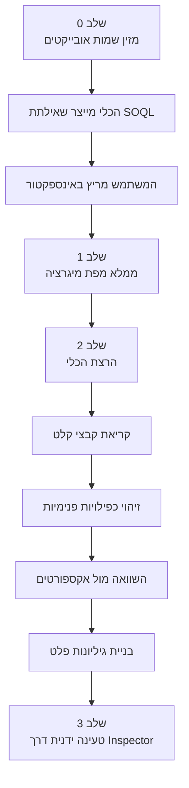

# כלי מיגרציית נתונים לסיילספורס

כלי Python שמקבל טבלאות נתונים של לקוחות (Google Sheets), ממפה אותן לאובייקטים בסיילספורס, ומייצר גיליונות טעינה מוכנים — כולל זיהוי כפילויות ואפסרט/אינסרט חכם.

## עקרונות מנחים

- הכלי גנרי ומודולרי — עובד עם כל לקוח וכל מבנה נתונים
- אין חיבור ישיר לסיילספורס — הכל דרך קבצים
- הכל ב-Google Sheets — קלט ופלט
- גמישות מקסימלית בהגדרת מיפויים ומזהים יוניקיים

---

## קבצי קלט

### 1. קובץ נתוני הלקוח
- Google Sheet עם הנתונים הגולמיים
- מבנה חופשי — תלוי בלקוח
- יכול להכיל מספר גיליונות

### 2. קובץ מבנה סביבת סיילספורס
- Google Sheet שמתקבל מהרצת שאילתת SOQL באינספקטור
- מכיל לכל שדה: Label, Name, API Name, סוג נתון
- נוצר אוטומטית מהשאילתה שהכלי מייצר (ראה [[#שלב 0 יצירת שאילתת SOQL]])

### 3. קובץ מפת מיגרציה
- Google Sheet שהמשתמש ממלא
- מגדיר: איזו עמודה מהקלט ממופה לאיזה שדה בסיילספורס
- מגדיר: אילו עמודות הן unique keys (לזיהוי כפילויות ואפסרט)
- מגדיר: סדר הטעינות ותלויות ביניהן

### 4. קבצי אקספורט מסיילספורס
- Google Sheet עם הרשומות הקיימות בסיילספורס (לכל אובייקט)
- משמש להשוואה: אפסרט vs אינסרט
- כולל קובץ נפרד לקשרים (Relationships) הקיימים

> [!warning] שיתוף Sheets
> כל Google Sheet שהכלי ניגש אליו חייב להיות משותף עם ה-Service Account.
> ראה [[Google Service Account]] לפרטים ולכתובת המייל.

---

## שלב 0: יצירת שאילתת SOQL

1. המשתמש מזין שמות API של אובייקטים רצויים בגיליון ייעודי
2. הכלי בונה שאילתת SOQL אוטומטית:

```sql
SELECT 
  EntityDefinition.Label, 
  EntityDefinition.QualifiedApiName,
  Label, 
  QualifiedApiName, 
  DataType 
FROM FieldDefinition 
WHERE EntityDefinition.QualifiedApiName 
IN ('Contact', 'Campaign', 'CampaignMember')
```

3. השאילתה מוצגת למשתמש להעתקה והרצה באינספקטור
4. תוצאת האינספקטור נשמרת כ-Google Sheet → קובץ קלט מס' 2

---

## מנגנון זיהוי כפילויות ואפסרט/אינסרט

### הגדרת מזהה יוניקי
- **מצב א':** עמודה בודדת כ-unique key
- **מצב ב':** שילוב של עמודות (שם + טלפון + תאריך לידה)

### תהליך
1. **כפילויות פנימיות** — בתוך קובץ הקלט עצמו
2. **השוואה מול סיילספורס** — מול קובץ האקספורט:
   - נמצאה התאמה → ==אפסרט== (כולל ה-ID הקיים)
   - לא נמצא → ==אינסרט==

### קשרים (Relationships)
- המזהה = ID של צד א' + ID של צד ב'
- הכלי בודק **שני כיוונים**: A→B וגם B→A נחשבים זהים
- מושווה מול אקספורט של קשרים קיימים

---

## קבצי פלט

Google Sheet חדש עם גיליון נפרד לכל טעינה, לפי סדר התלויות:

| גיליון | תוכן |
|--------|------|
| 1 | הורים / אנשי קשר ראשיים |
| 2 | ילדים / אנשי קשר משניים |
| 3 | Relationships (חדשים בלבד) |
| 4 | Campaign |
| 5 | Campaign Members |

כל גיליון פלט כולל עמודות מטא:

| עמודה | תיאור |
|-------|--------|
| `__Action` | Insert / Upsert |
| `__Id` | ריקה לאינסרט, מלאה לאפסרט |
| `__Status` | ריקה לפני טעינה |
| `__Errors` | ריקה לפני טעינה |

---

## מבנה הפרויקט

```
salesforce-migration-tool/
├── main.py
├── config/
│   └── settings.py
├── modules/
│   ├── sheets_reader.py
│   ├── sheets_writer.py
│   ├── soql_builder.py
│   ├── dedup_engine.py
│   ├── mapper.py
│   └── relationship_handler.py
├── templates/
│   └── migration_map_template.xlsx
└── requirements.txt
```

---

## זרימת עבודה



---

## נקודות פתוחות

> [!question]- מבנה מפת המיגרציה
> מה המבנה המדויק של קובץ מפת המיגרציה? אילו עמודות, ואיך מגדירים composite keys?

> [!question]- טיפול בשגיאות ולוגים
> מה האסטרטגיה? לוג לקובץ? הדפסה למסך? לכתוב שגיאות ישירות לגיליון הפלט?

> [!question]- מספר קבצי קלט במקביל
> האם לתמוך בלקוח עם כמה טבלאות מקור שרצות יחד?
