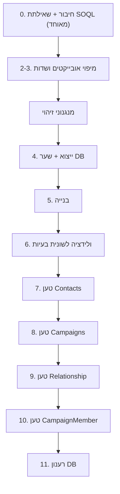

# כלי מיגרציה לסיילספורס — v1

> [!abstract] תקציר
> כלי Python מקומי שהופך **טמפלייט מובנה** (Google Sheet שהלקוח מילא) לטבלאות
> מוכנות לטעינה ידנית לסיילספורס דרך Salesforce Inspector. אין חיבור ישיר —
> הכל זורם דרך Google Sheets. ראה [[Google Service Account]] לפרטי הגישה.

## עקרונות-על

> [!important] שני עקרונות שמנחים את כל התכנון
> 1. **ארכיטקטורה:** מנוע גנרי + לוגיקה ספציפית-ללקוח **מבודדת** ב-`template_config.py`.
>    v1 נסגר על טמפלייט "מחנה פסח"; הכללה אמיתית רק כשיגיע לקוח שני (לא מכלילים מ-n=1).
> 2. **פשטות העבודה:** הקושי האמיתי אינו הלוגיקה אלא **נקודות-המגע הידניות מול Inspector**.
>    לכן: (א) UI הוא **wizard לינארי מודרך**; (ב) הכלי **מייצר כל שאילתת Inspector**;
>    (ג) **אזהרות עם "המשך בכל זאת"** — אף פעם לא חוסם.

הקלט הוא **הטמפלייט** (פורמט-ביניים מובנה), לא טבלת לקוח פראית. הטמפלייט הוא הממשק
הגנרי: כל לקוח שממלא אותו עובד, והכלי נשאר פשוט כי הקלט צפוי.

---

## קלט והרשאות

שלושה גיליונות, כולם דרך Google Sheets API + ה-service account:

| גיליון | תפקיד | הרשאה |
|--------|--------|--------|
| עותק הטמפלייט | קלט + עבודה (הכלי כותב) | **Editor** |
| קובץ DB | רשומות קיימות — לשוניות Contacts/Campaigns/Relationships | **Viewer** |
| מיפוי אובייקטים ושדות | מילון שדות (Label/API/DataType) — תוצאת שאילתת FieldDefinition | **Viewer** |

> [!warning] גיליון המקור — לא נוגעים
> המשתמש משכפל את המקור ומדביק את **העותק** בלבד. המקור לא מחובר לכלי כלל
> (הגנה מבנית). ראה [[Google Service Account]] — כל גיליון חייב שיתוף עם ה-service account.

**מסך חיבור:** נורית לכל גיליון — 🔴 חסר-גישה · 🟢 גישה נכונה · 🟡 עודף-גישה (ייעוץ).
נורית הטמפלייט בודקת **כתיבה** (`capabilities.canEdit`, בלי לכתוב); השאר קריאה.

---

## שלבי ה-Wizard



> [!note] שלב 0 ו-1 מאוחדים ב-UI
> בניית שאילתת ה-SOQL (למילון השדות) מוצגת כ-expander בתוך מסך החיבור —
> הזרימה רציפה: בנה שאילתה → הרץ ב-Inspector → הדבק קישור → בדוק חיבור.

0. **חיבור + שאילתת SOQL** — בונה שאילתת `FieldDefinition` (expander), חיבור 3 גיליונות ובדיקת גישה.
1. **(מוזג לשלב 0)**
2–3. **מיפוי אובייקטים ושדות** — טבלה inline: dropdown אובייקט+API פר-שורה, תיקון → נעילה לטמפלייט.
4. **ייצוא DB** — הכלי מייצר שאילתות SELECT פר-אובייקט (Id + כל שדות תקפים, ל-backfill/upsert); המשתמש מריץ ב-Inspector, שומר לגיליון DB (לשונית לכל אובייקט), ומסך הכלי מאמת טאבים + כמות רשומות + עמודת Id.
5. **בנייה** — מייצר גיליונות פלט (🔄 Contacts בהרצה; Campaigns/Relationship/CM בתור).
6. **ולידציה** — לשונית "בעיות" + UI.
7–10. **טעינה מודרכת** (ראה סדר טעינה).
11. **רענון DB** — לקראת הריצה הבאה.

---

## זיהוי זהות (dedup + lookup)

> [!tip] הגדרה אחת → שלושה שימושים
> אותם מנגנונים משרתים **dedup פנימי**, **איתור קיימים ב-DB**, ועמודת `__נמצא_לפי`.

מסך "מנגנוני זיהוי" — **3 מנגנונים בעדיפות מדורגת** (1→2→3). המשתמש בוחר שדות-API
(multi-select מהמאגר), והכלי מרכיב — אנלוגיית ה-SOQL. v1: המנגנונים ל-**Contacts בלבד**
(קמפיינים מזוהים בנפרד לפי שם):
- מנגנון 1: ברירת מחדל **ת"ז** (`ID_Number__c`, ניתן לשינוי).
- מנגנון 2/3: **שילובי שדות שאתה בוחר** (צירוף AND — כל שדות המנגנון).

> [!important] "מנצח" = **מצא התאמה**, לא "שדותיו מלאים"
> ההכרעה היא לפי *תוצאת ההתאמה*: מנסים מנגנון-בכל-פעם לפי הסדר, ונופלים למנגנון הבא
> גם כשהשדות מלאים אבל **ההתאמה נכשלה** (אין כזה ב-DB / אין כפילות). לכן שכבות
> החיפוש/dedup קוראות ל-`compute_key` מנגנון-בודד-בכל-פעם; המנוע עצמו גנרי וקבוע.
> - **איתור ב-DB:** מפל-עד-פגיעה מול אינדקס-DB פר-מנגנון → מביא `__Id`.
> - **dedup פנימי:** **קיבוץ עם שרשור** — שתי שורות שחולקות *כל* מנגנון = אותו אדם
>   (לא "ראשון מנצח"; שורות שלא חולקות שום שדה לא מתאחדות, וזה הנכון).
> - **`__נמצא_לפי`:** נרשם רק אם המנגנון *מצא* בפועל (לא רק כי לרשומה יש את השדה).

כל מנגנון ניתן לכיבוי. **ריבוי-התאמות** (>1) → צובע/מסמן (לא מביא Id עיוור). מי שלא נתפס
→ אינדיקציה + סימון ידני. נירמול ספרות-בלבד לטלפון/ת"ז — פנימי בלבד (לא נוגע בדאטה הנטענת),
יחד עם שכבת ההתאמה.

---

## פיצול ופלט

הכלי קורא את שורות הטמפלייט (שורה = הרשמה) ומייצר גיליונות-טעינה. **עמודות מטא**
בכל גיליון: `__Action` · `__Id` · `__Status` · `__Errors`. אחרי טעינה — מדביקים תוצאה, הכלי קורא `__Errors` → סיכום UI.

### Contacts — גיליון ייחודי
- שני בלוקי Contact נשפכים לגיליון אחד; dedup לפי מנגנוני הזיהוי → אדם אחד = שורה, עם `local_key`.
- נמצא → update (`__Id` קיים); לא → insert. **תמיד Upsert על SF Id** (הכלי מספק אותו).

> [!danger] Backfill — חובה
> Upsert **מוחק** שדה ריק (מאומת). לכן לרשומות **קיימות** הכלי ממלא תאים ריקים
> מהערך הקיים ב-DB. לכן ייצוא ה-Contacts חייב להכיל את **כל השדות הממופים**.

### Campaigns — גיליון ייחודי
dedup לפי **שם** (מנורמל, חיתוך רווחים). `local_key` משלו. Backfill כמו Contacts.

### Relationship — גיליון נגזר נקי
- עמודות תצוגה (שם א'/ב', סוג — **אדום בהיר, לא נטענות**) + `ContactA_Id`, `ContactB_Id`, Type + מטא.
- **dedup + בדיקת-קיום: זוג SF Id (18) ממוין** (א↔ב=ב↔א), אחרי טעינת אנשי הקשר.
- **כיוון אחד** — NPSP יוצר את ההפוך אוטומטית.

### CampaignMember — גיליון נגזר
- שורה לכל "משתתף באירוע"=TRUE (0/1/2 לשורה). עמודות תצוגה + `ContactId`, `CampaignId`, Status, מחיר + מטא.
- **עמודות נודדות** (מחיר/סטטוס) ממופות לכאן אף שיושבות בבלוקים אחרים → מיפוי פר-עמודה.
- **v1: טוען את כולם** ללא בדיקת-קיום.

### הטבלה הרחבה = עותק העבודה ("קוקפיט")
דאטה + אנוטציות מיפוי + `local_key`. בלוקי Contact/Campaign מצומצמים (`local_key` + `__Id` מנוסחה). **לא נטענים ממנה.**

> [!note] `local_key`
> מזהה פנימי **רק לאנשי קשר וקמפיינים** (Relationship/CampaignMember רק צורכים Id).
> נחתם **פעם אחת** במעבר dedup דטרמיניסטי, **נשמר, לא נגזר מחדש**. מחזיר את ה-SF Id
> מהגיליון הייחודי לכל הופעה — **התאמה מדויקת, לא לפי שם/ת"ז**.

---

## סדר טעינה

> [!info] רענוני DB מתקבצים לשניים
> **שער אחרי המיפוי** + **רענון בסוף**. אין רענון באמצע — הקשרים שואבים Id
> מהגיליונות הייחודיים (local_key), לא מה-DB.

חיבור → מיפויים → **ייצוא+שער DB** → בנייה → ולידציה → טען **Contacts** → **Campaigns**
(נוסחאות `__Id` מתמלאות) → **Relationship** → **CampaignMember** → **רענון DB**.
כל טעינה: טען → הדבק → ✅ בדיקה. אזהרות עם override (למשל אם Id ריקים).

---

## פירמוט ערכים (מינימלי)

- **תאריכים:** תא תאריך-אמיתי → `YYYY-MM-DD` אוטומטית. תא טקסט → **toggle אופציונלי**
  "פרש כ-`DD.MM.YYYY`"; מה שלא נפרסר → תא אדום + "בעיות". המרה = שכבה נגזרת, **המקור לא נדרס**.
- **טקסט:** חיתוך רווחים בקצוות.
- **לא ב-v1:** מספרים, בוליאני, תרגום פיקליסט. ערכי פיקליסט/סוג/סטטוס חייבים להיות
  חוקיים בטמפלייט (dropdowns); ערך לא-חוקי → שגיאה ב-`__Errors` בטעינה.

---

## ולידציה, בעיות ולוגים

- **מעבר ולידציה לפני בנייה** → לשונית "בעיות" + UI. בודק: עמודה ללא החלטה;
  שדה API שלא קיים; תאריך-טקסט שלא פוּרסַר; אורך Id ≠ 18 (אין ממיר).
- תאים בעייתיים **נצבעים**. **לוג מינימלי** — שגיאות/קריסות בלבד.

---

## מבנה הקוד

```
main.py                  # ✅ הפעלת Streamlit wizard (4 מסכים: חיבור/מיפוי/זיהוי/ייצוא DB)
config/
  settings.py            # ✅ credentials, מזהי Sheets
  template_config.py     # ✅ כללי מחנה פסח (מבודד) — BLOCK_TO_OBJECT, DIGITS_ONLY_FIELDS, DB_TAB_NAMES
modules/
  sheets_io.py           # ✅ קריאה/כתיבה Sheets (read_values, write_cells, col_letter, check_access)
  query_builder.py       # ✅ מייצר שאילתות Inspector (FieldDefinition + SELECT לייצוא DB)
  field_dictionary.py    # ✅ פירוק תוצאת Inspector → מילון שדות
  mapper.py              # ✅ מיפוי אובייקט+שדה פר-עמודה + ולידציה מול מילון
  identity.py            # ✅ מנוע חישוב מפתח-זהות (compute_key, מנגנון-בכל-פעם)
  recent_sheets.py       # ✅ זיכרון MRU גיליונות אחרונים פר-תפקיד
  dedup_engine.py        # ✅ קיבוץ פנימי (שרשור/union-find) + הצלבת DB → Insert/Upsert + local_key
  splitter.py            # ✅ פיצול שורות → רשומות פר-בלוק (Contacts בנוי; Campaign/CM בעתיד)
  output_writer.py       # 🔄 build_contacts_grid ✅ (backfill, META_COLUMNS) — Campaigns/Relationship/CM בתור
  formatter.py           # ⏳ תאריכים/טקסט
  validator.py           # ⏳ ולידציה → "בעיות"
requirements.txt
credentials.json         # ב-.gitignore
```

> [!note] מקרא: ✅ בנוי ומאומת · 🔄 בבנייה (חלקי) · ⏳ מתוכנן

---

## דרישות-קדם ואימות

> [!todo] לפני קוד
> 1. שתף את 3 הגיליונות עם ה-service account (Editor/Viewer). ראה [[Google Service Account]].
> 2. `credentials.json` קיים.
> 3. מאומת: upsert עם תא ריק **מוחק** דאטה → backfill חובה.

**אימות (מול הגיליונות, ללא חיבור ל-SF):** שאילתת SOQL תקינה · מילון מפורק · מיפוי
+ "התעלם" + dropdowns · dedup (צורית פעם אחת) + backfill · מפתח קנוני (18) · צביעות ·
לשונית "בעיות" · נוסחאות `__Id` מתמלאות · נורות חיבור · wizard עם override.

---

## מחוץ ל-v1 (מודע)

ריבוי טבלאות מקור · בדיקת-קיום ל-CampaignMember · תרגום פיקליסט · פירמוט מספרים/בוליאני ·
עדכון DB אוטומטי · המרת Id 15→18 · בדיקת ערכי-פיקליסט מקדימה.
