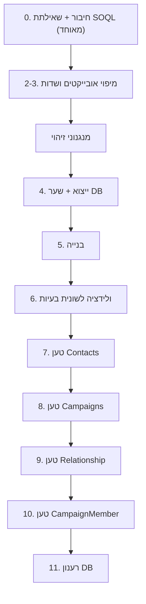

# כלי מיגרציה לסיילספורס — v1

> [!abstract] תקציר
> כלי Python מקומי שהופך **טמפלייט מובנה** (Google Sheet שהלקוח מילא) לטבלאות
> מוכנות לטעינה ידנית לסיילספורס דרך Salesforce Inspector. אין חיבור ישיר —
> הכל זורם דרך Google Sheets. ראה [[Google Service Account]] לפרטי הגישה.

## עקרונות-על

> [!important] שני עקרונות שמנחים את כל התכנון
> 1. **ארכיטקטורה:** מנוע גנרי + לוגיקה ספציפית-ללקוח **מבודדת** ב-`template_config.py`.
>    v1 נסגר על טמפלייט "מחנה פסח"; הכללה אמיתית רק כשיגיע לקוח שני (לא מכלילים מ-n=1).
> 2. **פשטות העבודה:** הקושי האמיתי אינו הלוגיקה אלא **נקודות-המגע הידניות מול Inspector**.
>    לכן: (א) UI הוא **wizard לינארי מודרך**; (ב) הכלי **מייצר כל שאילתת Inspector**;
>    (ג) **אזהרות עם "המשך בכל זאת"** — אף פעם לא חוסם.

הקלט הוא **הטמפלייט** (פורמט-ביניים מובנה), לא טבלת לקוח פראית. הטמפלייט הוא הממשק
הגנרי: כל לקוח שממלא אותו עובד, והכלי נשאר פשוט כי הקלט צפוי.

---

## קלט והרשאות

שלושה גיליונות, כולם דרך Google Sheets API + ה-service account:

| גיליון | תפקיד | הרשאה |
|--------|--------|--------|
| עותק הטמפלייט | קלט + עבודה (הכלי כותב) | **Editor** |
| קובץ DB | רשומות קיימות — לשוניות Contacts/Campaigns/Relationships | **Viewer** |
| מיפוי אובייקטים ושדות | מילון שדות (Label/API/DataType) — תוצאת שאילתת FieldDefinition | **Viewer** |

> [!warning] גיליון המקור — לא נוגעים
> המשתמש משכפל את המקור ומדביק את **העותק** בלבד. המקור לא מחובר לכלי כלל
> (הגנה מבנית). ראה [[Google Service Account]] — כל גיליון חייב שיתוף עם ה-service account.

**מסך חיבור:** נורית לכל גיליון — 🔴 חסר-גישה · 🟢 גישה נכונה · 🟡 עודף-גישה (ייעוץ).
נורית הטמפלייט בודקת **כתיבה** (`capabilities.canEdit`, בלי לכתוב); השאר קריאה.

---

## שלבי ה-Wizard



> [!note] שלב 0 ו-1 מאוחדים ב-UI
> בניית שאילתת ה-SOQL (למילון השדות) מוצגת כ-expander בתוך מסך החיבור —
> הזרימה רציפה: בנה שאילתה → הרץ ב-Inspector → הדבק קישור → בדוק חיבור.

0. **חיבור + שאילתת SOQL** — בונה שאילתת `FieldDefinition` (expander), חיבור 3 גיליונות ובדיקת גישה.
1. **(מוזג לשלב 0)**
2–3. **מיפוי אובייקטים ושדות** — טבלה inline: dropdown אובייקט+API פר-שורה, תיקון → נעילה לטמפלייט.
4. **ייצוא DB** — הכלי מייצר שאילתות SELECT פר-אובייקט (Id + כל שדות תקפים, ל-backfill/upsert); המשתמש מריץ ב-Inspector, שומר לגיליון DB (לשונית לכל אובייקט), ומסך הכלי מאמת טאבים + כמות רשומות + עמודת Id.
5. **בנייה** — מייצר גיליונות פלט (✅ Contacts/Campaigns/Relationships/CampaignMember).
   **ולידציית-נתונים מבוזרת** רצה בתוך כל מסך-בנייה (אוטומטית + "בדוק שוב"), עם סימון אדום
   והערת-תא על גיליון-הטעינה.

> [!note] עדכון UX (2026-06-04)
> פאנל-הצד עבר למספור רץ **1–8**; **מסך-הוולידציה הנפרד (6) הוסר** והוטמע בכל מסך-בנייה;
> שלבי-טעינה מודרכת **7–11 נסגרו כלא-נדרשים ל-v1** (המשתמש טוען ידנית מול Inspector ומרענן
> DB ביד).

> [!success] שיפורי פוליש UI (2026-06-08) — 115 בדיקות, 0 כשלים ✅
> - **dropdown מיפוי:** מציג שם-שדה בעברית (Label), מזין ה-API מאחורי הקלעים; כפילות-תוויות → API בסוגריים.
> - **נוריות:** INVALID+MISSING אוחדו לנורית 🔴 "התאמה שגויה/חסרה"; בקרה 🎚️→🏳️; "האובייקט לא בשאילתא".
> - **הודעת בדיקה:** "לא נמצאו בעיות ✅ (נבדקו: תאריכים ומזהי Id)".
> - **כפתורי-צד:** "רענן את 3 הגיליונות" · "רענן ואפס מנגנונים ומיפוי".
> - **CLAUDE.md** עודכן לשקף מצב v1 מוכן (לא שלב תכנון).

### סרגל-תהליך עליון

> [!success] סרגל-תהליך עליון + איחוד 8→5 שלבים (2026-06-08) — 115 בדיקות, 0 כשלים ✅
> שכבת-תצוגה/ניווט בלבד; **המנועים (`modules/`) לא נגעו.** מומש ב-5 פרוסות (A–E).
> - **ניווט:** `_topbar()` — סרגל אופקי עם 5 שלבים, ניווט בלחיצה (`st.session_state["step"]`,
>   כפתור primary לשלב הפעיל). **רדיו-הצד הוסר**; סרגל-הצד צומצם ל-280–320px עם כפתורי-רענון
>   בראש ופתק-הערות (520px) ברוב השטח.
> - **5 שלבים (`STEPS`):** 1. חיבור + שאילתות (`screen_step1`) · 2. מיפוי · 3. מנגנוני זיהוי ·
>   4. גיליונות ראשיים (Contacts/Campaigns) · 5. גיליונות מותנים (Relationships/CampaignMember).
>   החלוקה 4/5 **לפי תלות** (מותנים = תלויי-Ids שחוזרים מ-SF). תת-ניווט בשלבים 4–5 = `st.radio`
>   אופקי (לא `st.tabs` — שלא יריצו שני הצינורות בכל רינדור).
> - **סטטוס חי (lazy):** `_set_status(step,text,sub)` + `_status_badge` + `_truncate`. כל מסך כותב
>   badge בסוף הצינור; הסרגל בלבד קורא. שלב 1: n/3 מחוברים · 2: ✅/🏳️/🔴 · 3: ✓+שם-שדה מקוצר ·
>   4: חדשים/קיימים פר-בונה · 5: קשרים/CM. בפתיחה "—" עד ביקור/הרצה.
> - **שלב 1 מאוחד:** `screen_db_export` פוצל ל-`_db_queries` + `screen_queries` (dropdown על
>   שאילתות מילון + ייצוא-DB לכל אובייקט, תיבת-עריכה + `st.code` להעתקה LTR) + `screen_db_validation`.
> - **+2 מנגנונים:** `_N_MECHANISMS` 3→5. כותרות-מסך — מספור-קשיח הוסר (הסרגל ממספר).
> - אומת ב-`AppTest`: 5 שלבים, 0 exceptions, תת-ניווט תקין. אימות חי (RTL/Google) — בהרצת המשתמש.

> [!success] סבב פוליש שני לסרגל ולמסכים (2026-06-08) — מאומת חי ב-preview · 115 בדיקות ✅
> לפי פידבק חי; `main.py` בלבד, אומת מקצה-לקצה עם כלי ה-preview (inspect/eval על ה-DOM):
> - **כרטיסי-מצב צבעוניים (אפשרות B):** `_topbar` עוצב מחדש — מספר בתוך שורת-השם (`2. מיפוי`),
>   badge בשורה שנייה (label דו-פסקתי → שני `<p>`), צביעה דינמית דרך `.st-key-nav_{i}`:
>   🟩 ירוק=הושלם/מחובר · ⬜ לבן=טרם בוקר · ◻️ אפור=לא-הושלם/התנתק · מסגרת כחולה=הפעיל.
>   מצב נקבע ב-`_step_state` + דגל `ok` ב-`_set_status` (מילון `status_ok`); חיבור: `ok=(n_linked==3)`.
> - **Chrome:** הוסתרו Deploy + חיצי-כיווץ הסרגל-צד (CSS); `block-container` padding-top 6→2.5rem;
>   הכותרת עברה מ-`st.title` לראש הסרגל-**צד** (מעל הרענון). `initial_sidebar_state="expanded"`
>   **קריטי** — ב-Streamlit 1.58 סרגל מכווץ מוסר מה-DOM, ובלי כפתור-כיווץ המשתמש היה ננעל בחוץ.
> - **מנגנונים:** באג-תזמון תוקן (הסטטוס נקבע *לפני* `st.rerun`, אחרת ה-badge מתעדכן לחיצה-באיחור);
>   ה-badge מציג **כל** שדות-המנגנון (לא רק הראשון); פריסת 2 עמודות (1\|2, 3\|4, 5 לבד).
> - **תת-ניווט 4/5:** `st.radio`→כפתורים אנכיים גדולים (58px) עם badge פר-גיליון, כולל
>   **חיווי בדיקת תאריך/Id** ("✅ נבדק"/"⚠️ N בעיות"). `_validation_summary` מחזיר `(marks,n_issues)`,
>   `_val_badge` שוזר ל-badge של כל בונה (contacts/campaigns/rel/cm).
> - **צמצום-גובה:** `st.header`→`st.subheader` בכל המסכים; הסברים ארוכים → `st.caption`
>   (אזהרות "טען Ids קודם" נשמרו גלויות כ-`st.info`).

> [!success] תיקוני QA (2026-06-05) — מאומת בסבב מלא 35/35 ✅ · ראה [[תוצאות-QA]]
> - **מסך מנגנוני-זיהוי:** חזרה למסך אחרי ניווט כבר לא מאפסת ויזואלית את הבחירה — ווידג'טים נזרעים מהקונפיג השמור (תיקון באג שקט שיכול היה לדרוס מנגנון 2 בשקט).
> - **מסך קשרים:** אינדיקציית בדיקת-כפילויות בראש התוצאות (רשומות שנקראו → זוגות ייחודיים לאחר איחוד A↔B).
> - **הודעת-ולידציה:** בתצוגה-מקדימה מנחה "לחץ בנה וכתוב כדי לסמן (למשל J16)" במקום להבטיח תא אדום שעוד לא נכתב; אחרי-כתיבה מציינת את לשונית-הפלט והתא.

> [!important] עמידות להוספת עמודות (אומת e2e, 2026-06-05)
> הוספת עמודות לטמפלייט (כשהטאב נשאר `טמפלייט טעינה`) **עוברת תקין את כל ארבעת הטעינות**
> (Contacts/Campaigns/Relationships/CampaignMember), כולל אחרי הדבקת תוצאות מ-Inspector
> (עמודת `__Id` במיקום-זז). הסיבה: **כל הקריאות לפי שם-כותרת** (block/API/`__Id`/`local_key`),
> אף פעם לא לפי מספר-עמודה; `local_key` נחתם לפי סדר-שורות (יציב לעמודות). **תנאים:** שמות-הבלוקים
> נשמרים והעמודות החדשות ממופות ל-API תקין. (השמות הספציפיים-ללקוח עדיין ב-`template_config` —
> הכללה מלאה לתבנית אחרת = פרויקט "לקוח שני".)

---

## זיהוי זהות (dedup + lookup)

> [!tip] הגדרה אחת → שלושה שימושים
> אותם מנגנונים משרתים **dedup פנימי**, **איתור קיימים ב-DB**, ועמודת `__נמצא_לפי`.

מסך "מנגנוני זיהוי" — **3 מנגנונים בעדיפות מדורגת** (1→2→3). המשתמש בוחר שדות-API
(multi-select מהמאגר), והכלי מרכיב — אנלוגיית ה-SOQL. v1: המנגנונים ל-**Contacts בלבד**
(קמפיינים מזוהים בנפרד לפי שם):
- מנגנון 1: ברירת מחדל **ת"ז** (`ID_Number__c`, ניתן לשינוי).
- מנגנון 2/3: **שילובי שדות שאתה בוחר** (צירוף AND — כל שדות המנגנון).

> [!important] "מנצח" = **מצא התאמה**, לא "שדותיו מלאים"
> ההכרעה היא לפי *תוצאת ההתאמה*: מנסים מנגנון-בכל-פעם לפי הסדר, ונופלים למנגנון הבא
> גם כשהשדות מלאים אבל **ההתאמה נכשלה** (אין כזה ב-DB / אין כפילות). לכן שכבות
> החיפוש/dedup קוראות ל-`compute_key` מנגנון-בודד-בכל-פעם; המנוע עצמו גנרי וקבוע.
> - **איתור ב-DB:** מפל-עד-פגיעה מול אינדקס-DB פר-מנגנון → מביא `__Id`.
> - **dedup פנימי:** **קיבוץ עם שרשור** — שתי שורות שחולקות *כל* מנגנון = אותו אדם
>   (לא "ראשון מנצח"; שורות שלא חולקות שום שדה לא מתאחדות, וזה הנכון).
> - **`__נמצא_לפי`:** נרשם רק אם המנגנון *מצא* בפועל (לא רק כי לרשומה יש את השדה).

כל מנגנון ניתן לכיבוי. נירמול ספרות-בלבד לטלפון/ת"ז — פנימי בלבד (לא נוגע בדאטה הנטענת),
יחד עם שכבת ההתאמה.

> [!important] ריבוי-התאמות — צירוף-מדורג ואז טיפול ידני (פרוסות 7–8, מאומת)
> **>1 התאמה** אף פעם לא מביא Id עיוור. קודם **צירוף-מנגנונים מדורג**: העוגן (מנגנון
> ראשון שתפס) עם >1 → חיתוך עם מנגנוני-ההמשך עד צמצום ל-Id יחיד → Upsert, מסומן
> 🟠 **הכרעה-בשילוב** ("שילוב 1+2") כי פחות-בטוח. עדיין >1 (או חסר-זיהוי) → יוצא
> מהטעינה ל**לשונית "טיפול ידני"**: רשומת-הקלט לצד מועמדי-המאגר, המשתמש מסמן ✓ את
> הנכון, וכפתור בונה-וכותב קולט את הבחירה כ-Upsert (אידמפוטנטי, הסימון נשמר).
> **נדחה ל-v2:** הוספת שדה-מבחין אינטראקטיבי לשבירת-שוויון בכמות.

---

## פיצול ופלט

הכלי קורא את שורות הטמפלייט (שורה = הרשמה) ומייצר גיליונות-טעינה. **עמודות מטא**
בכל גיליון: `__Action` · `__Id` · `__Status` · `__Errors`. אחרי טעינה — מדביקים תוצאה, הכלי קורא `__Errors` → סיכום UI.

### Contacts — גיליון ייחודי
- שני בלוקי Contact נשפכים לגיליון אחד; dedup לפי מנגנוני הזיהוי → אדם אחד = שורה, עם `local_key`.
- נמצא → update (`__Id` קיים); לא → insert. **תמיד Upsert על SF Id** (הכלי מספק אותו).

> [!danger] Backfill — חובה
> Upsert **מוחק** שדה ריק (מאומת). לכן לרשומות **קיימות** הכלי ממלא תאים ריקים
> מהערך הקיים ב-DB. לכן ייצוא ה-Contacts חייב להכיל את **כל השדות הממופים**.

### Campaigns — גיליון ייחודי ✅
dedup לפי **שם** (מנורמל, חיתוך רווחים), מנגנון יחיד `[["Name"]]` דרך אותו מנוע גנרי.
`local_key` משלו (קידומת `"K"`). Backfill כמו Contacts. תא "נמצא לפי" = "קיים" 🟢/ריק
(אין מספרי-מנגנון — מנגנון אחד). ambiguous (שני קמפייני-DB באותו שם)/unkeyed (שם ריק)
→ לשונית "טיפול ידני" (אותו מנגנון גנרי של Contacts).

### Relationship — גיליון נגזר נקי ✅
- עמודות תצוגה (שם א'/ב' — **אדום בהיר, לא נטענות**) + `npe4__Contact__c`, `npe4__RelatedContact__c`, `npe4__Type__c`.
- **גזירה:** כל שורה עם ראשי+נוסף → קשר. זוג ממוין (א↔ב=ב↔א). קיימים-ב-DB מסוננים.
- **כיוון אחד** — NPSP יוצר את ההפוך אוטומטית.
- **UX:** כפתור יחיד — לאחר טעינת Contacts + הדבקת Ids.
- **שקיפות כפילויות:** בראש התוצאות מוצגת אינדיקציה: "נקראו N קשרים מהמאגר → M זוגות ייחודיים (A↔B אוחדו) · K דולגו". שני המספרים מוכיחים את האיחוד הדו-כיווני בפועל.

### CampaignMember — גיליון נגזר ✅
- שורה לכל "משתתף באירוע"=TRUE (0/1/2 לשורה). עמודת-תצוגה (שם, אדום-בהיר) + `ContactId`, `CampaignId`, ושדות STATUS_VALID נוספים.
- עמודות נודדות (מחיר/סטטוס) ממופות לכאן ע"י WANDERING_OVERRIDES → STATUS_VALID per block.
- **v1: טוען את כולם** ללא בדיקת-קיום (מוסכם). כפתור יחיד — לאחר טעינת Contacts+Campaigns.

### הטבלה הרחבה = עותק העבודה ("קוקפיט")
דאטה + אנוטציות מיפוי + `local_key`. בלוקי Contact/Campaign מצומצמים (`local_key` + `__Id` מנוסחה). **לא נטענים ממנה.**

> [!note] `local_key`
> מזהה פנימי **רק לאנשי קשר וקמפיינים** (Relationship/CampaignMember רק צורכים Id).
> נחתם **פעם אחת** במעבר dedup דטרמיניסטי, **נשמר, לא נגזר מחדש**. מחזיר את ה-SF Id
> מהגיליון הייחודי לכל הופעה — **התאמה מדויקת, לא לפי שם/ת"ז**.

---

## סדר טעינה

> [!info] רענוני DB מתקבצים לשניים
> **שער אחרי המיפוי** + **רענון בסוף**. אין רענון באמצע — הקשרים שואבים Id
> מהגיליונות הייחודיים (local_key), לא מה-DB.

חיבור → מיפויים → **ייצוא+שער DB** → בנייה → ולידציה → טען **Contacts** → **Campaigns**
(נוסחאות `__Id` מתמלאות) → **Relationship** → **CampaignMember** → **רענון DB**.
כל טעינה: טען → הדבק → ✅ בדיקה. אזהרות עם override (למשל אם Id ריקים).

---

## פירמוט ערכים (מינימלי)

- **תאריכים:** תא תאריך-אמיתי → `YYYY-MM-DD` אוטומטית. תא טקסט → **toggle אופציונלי**
  "פרש כ-`DD.MM.YYYY`"; מה שלא נפרסר → תא אדום + "בעיות". המרה = שכבה נגזרת, **המקור לא נדרס**.
- **טקסט:** חיתוך רווחים בקצוות.
- **לא ב-v1:** מספרים, בוליאני, תרגום פיקליסט. ערכי פיקליסט/סוג/סטטוס חייבים להיות
  חוקיים בטמפלייט (dropdowns); ערך לא-חוקי → שגיאה ב-`__Errors` בטעינה.

---

## ולידציה, בעיות ולוגים

- **מעבר ולידציה לפני בנייה** → לשונית "בעיות" + UI. בודק: עמודה ללא החלטה;
  שדה API שלא קיים; תאריך-טקסט שלא פוּרסַר; אורך Id ≠ 18 (אין ממיר).
- תאים בעייתיים **נצבעים**. **לוג מינימלי** — שגיאות/קריסות בלבד.

---

## מבנה הקוד

```
main.py                  # ✅ Streamlit wizard: חיבור/מיפוי/זיהוי/ייצוא DB/בנייה (×4)/ולידציה
config/
  settings.py            # ✅ credentials, מזהי Sheets
  template_config.py     # ✅ כללי מחנה פסח (מבודד) — BLOCK_TO_OBJECT, DIGITS_ONLY_FIELDS, DB_TAB_NAMES, OUTPUT_TAB_CONTACTS, OUTPUT_TAB_MANUAL_CONTACTS
modules/
  sheets_io.py           # ✅ קריאה/כתיבה Sheets (read_values, write_cells, write_grid, ensure_tab, rows_to_dicts, col_letter, check_access)
  query_builder.py       # ✅ מייצר שאילתות Inspector (FieldDefinition + SELECT לייצוא DB)
  field_dictionary.py    # ✅ פירוק תוצאת Inspector → מילון שדות
  mapper.py              # ✅ מיפוי אובייקט+שדה פר-עמודה + ולידציה מול מילון
  identity.py            # ✅ מנוע חישוב מפתח-זהות (compute_key, מנגנון-בכל-פעם)
  recent_sheets.py       # ✅ זיכרון MRU גיליונות אחרונים פר-תפקיד
  notes_store.py         # ✅ פתק-הערות אישי בפאנל-הצד (נשמר ל-.notes.txt)
  dedup_engine.py        # ✅ קיבוץ פנימי (שרשור/union-find) + הצלבת DB → Insert/Upsert + local_key
  splitter.py            # ✅ פיצול שורות → רשומות פר-בלוק (Contacts + Campaign; CM בעתיד)
  output_writer.py       # ✅ build_contacts_grid + build_campaigns_grid (dedup לפי שם, תא "קיים") + build_manual_grid + parse_manual_choices (טיפול ידני) — Relationship/CM בתור
  formatter.py           # ✅ תאריכים/טקסט (parse_date, normalize_text)
  validator.py           # ✅ ולידציה מבוזרת: validate_output_grid (תאריכים/אורך-Id) רצה בכל מסך-בנייה
tests/
  test_identity.py       # ✅ compute_key: עדיפות, AND, דרישת-שדות, נירמול
  test_splitter.py       # ✅ פיצול בלוקים, דילוג ריק, source_row, סינון-שדות
  test_dedup_engine.py   # ✅ שרשור, Upsert/Insert, צירוף-מדורג, ambiguous, unkeyed, מונים, רגרסיית פרוסה 7
  test_output_writer.py  # ✅ backfill, קונסולידציה, צבעי "נמצא לפי", טיפול ידני, אידמפוטנטיות
  test_formatter.py      # ✅ parse_date (פורמטים/זבל/ריק), normalize_text
  test_validator.py      # ✅ מיפוי→Issue, תאריכים, אורך-Id, build_issues_grid
qa_e2e.py               # כלי-עזר QA (לא חלק מהכלי) — 21 תרחישים מול גיליון אמיתי
qa_run.py               # כלי-עזר QA מלא (2026-06-05) — 35 תרחישים D1–D14, כל המסכים, ראה [[בדיקות-QA]]
qa_probe.py             # כלי-עזר — שליפת ערכים מה-DB לבנית נתוני-הדמה
requirements.txt
credentials.json         # ב-.gitignore
```

> [!note] מקרא: ✅ בנוי ומאומת · 🔄 בבנייה (חלקי) · ⏳ מתוכנן

> [!tip] הרצת הבדיקות
> `python -m pytest -q` — ריצה מהירה (115 בדיקות, אפס I/O).
> לבדיקות חיות מקצה-לקצה מול הגיליונות האמיתיים — ראה [[בדיקות-QA]].

---

## דרישות-קדם ואימות

> [!todo] לפני קוד
> 1. שתף את 3 הגיליונות עם ה-service account (Editor/Viewer). ראה [[Google Service Account]].
> 2. `credentials.json` קיים.
> 3. מאומת: upsert עם תא ריק **מוחק** דאטה → backfill חובה.

**אימות (מול הגיליונות, ללא חיבור ל-SF):** שאילתת SOQL תקינה · מילון מפורק · מיפוי
+ "התעלם" + dropdowns · dedup (צורית פעם אחת) + backfill · מפתח קנוני (18) · צביעות ·
לשונית "בעיות" · נוסחאות `__Id` מתמלאות · נורות חיבור · wizard עם override.

---

## מחוץ ל-v1 (מודע)

ריבוי טבלאות מקור · בדיקת-קיום ל-CampaignMember · תרגום פיקליסט · פירמוט מספרים/בוליאני ·
עדכון DB אוטומטי · המרת Id 15→18 · בדיקת ערכי-פיקליסט מקדימה.
